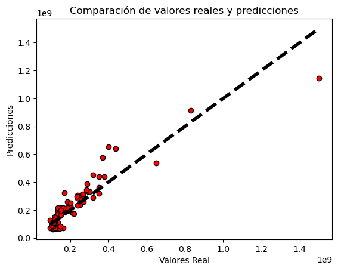

<h1>Modelo predictivo del posible valor que puede tener una casa en la ciudad de villavicencio</h1>

<h3>Descripcionn:</h3>

<la>Es un modelo  que busca brindar a los interesados en el mercado inmobiliario de Villavicencio, una herramienta para predecir los precios de las viviendas en la ciudad. Utilizando técnicas de aprendizaje automático y un gran conjunto de datos históricos del mercado inmobiliario de Villavicencio, este modelo busca proporcionar una visión precisa y actualizada de las tendencias del mercado y ayudar a los compradores, vendedores y inversores a tomar decisiones informadas.</la>

<h3>Pasos:</h3>

<li>Recoleccion de los datos de la pagina https://www.properati.com.co/s/villavicencio/casa/venta/</li>
<li>Limpieza y preparación de los datos</li>
<li>Análisis exploratorio de los datos</li>
<li>Separacion de los datos en conjuntos de entrenamiento y de test</li>
<li>Creación de Modelo de Machine Learning y visualizaciones para presentar los hallazgos</li>
<li>Medicion de la presicion del Modelo</li>
<li>Crear un informe de conclusiones y recomendaciones para inversionistas inmobiliarios.</li>
<li>Herramientas y tecnologías utilizadas: Python, Pandas, Matplotlib, Jupyter notebook</li>


<h4>Este segmento de código están importando las librerías necesarias para trabajar con un modelo de regresión lineal en Python: pandas para trabajar con los datos, scikit-learn's LinearRegression para aplicar el modelo de regresión lineal y train_test_split de scikit-learn para dividir los datos en conjuntos de entrenamiento y prueba.</h4> 


```python
# importamos la librería pandas
import pandas as pd

# importamos la librería LinearRegression
from sklearn.linear_model import LinearRegression

# importamos la librería train_test_split
from sklearn.model_selection import train_test_split

# importamos la librería matplotlib
import matplotlib.pyplot as plt
```


```python
# utilizamos el método 'pd.read_excel' para leer un archivo xlsx y guardarlo en un DataFrame 'df'
df = pd.read_excel('Datos.xlsx')

# imprimimos el DataFrame 'df' para verificar que los datos se hayan cargado correctamente.
df
```


<div>
<table border="1" class="dataframe">
  <thead>
    <tr style="text-align: right;">
      <th></th>
      <th>Habitaciones</th>
      <th>Baños</th>
      <th>Mts2</th>
      <th>Estrato</th>
      <th>Precio</th>
    </tr>
  </thead>
  <tbody>
    <tr>
      <th>0</th>
      <td>9</td>
      <td>6</td>
      <td>153</td>
      <td>1</td>
      <td>490000000</td>
    </tr>
    <tr>
      <th>1</th>
      <td>2</td>
      <td>1</td>
      <td>84</td>
      <td>1</td>
      <td>90000000</td>
    </tr>
    <tr>
      <th>2</th>
      <td>3</td>
      <td>1</td>
      <td>375</td>
      <td>1</td>
      <td>270000000</td>
    </tr>
    <tr>
      <th>3</th>
      <td>3</td>
      <td>2</td>
      <td>100</td>
      <td>1</td>
      <td>215000000</td>
    </tr>
    <tr>
      <th>4</th>
      <td>7</td>
      <td>4</td>
      <td>170</td>
      <td>1</td>
      <td>190000000</td>
    </tr>
    <tr>
      <th>...</th>
      <td>...</td>
      <td>...</td>
      <td>...</td>
      <td>...</td>
      <td>...</td>
    </tr>
    <tr>
      <th>349</th>
      <td>3</td>
      <td>4</td>
      <td>160</td>
      <td>5</td>
      <td>550000000</td>
    </tr>
    <tr>
      <th>350</th>
      <td>3</td>
      <td>4</td>
      <td>290</td>
      <td>5</td>
      <td>680000000</td>
    </tr>
    <tr>
      <th>351</th>
      <td>4</td>
      <td>5</td>
      <td>170</td>
      <td>5</td>
      <td>720000000</td>
    </tr>
    <tr>
      <th>352</th>
      <td>4</td>
      <td>4</td>
      <td>140</td>
      <td>5</td>
      <td>500000000</td>
    </tr>
    <tr>
      <th>353</th>
      <td>4</td>
      <td>4</td>
      <td>270</td>
      <td>5</td>
      <td>950000000</td>
    </tr>
  </tbody>
</table>
<p>354 rows × 5 columns</p>
</div>


<h4>Este segmento de código están dividiendo los datos en dos conjuntos: uno para entrenar el modelo y otro para probarlo. La primera línea está asignando todas las columnas del DataFrame excepto la última a una variable llamada "x", que será utilizada como datos de entrada para el modelo. La segunda línea está asignando la última columna del DataFrame a una variable llamada "y", que será utilizada como la variable objetivo o salida del modelo. La tercera línea está utilizando la función train_test_split para dividir los datos en dos conjuntos, uno para entrenar el modelo y otro para probarlo, estableciendo el tamaño del conjunto de prueba en el 20% del total.</h4>


```python
""" Asigna todas las columnas del DataFrame excepto la última a una variable x,
que será utilizada como datos de entrada para el modelo"""
x = df.iloc[:, :-1]  

# Asigna la última columna del DataFrame a una variable y, que será utilizada como la variable objetivo o salida del modelo
y = df.iloc[:, -1]

""" utiliza la función train_test_split para dividir los datos en dos conjuntos,
uno para entrenar el modelo y otro para probarlo, estableciendo el tamaño del conjunto de prueba en el 20% del total"""
x_train, x_test, y_train, y_test = train_test_split(x, y, test_size=0.2)

```

<h4>Estas líneas de código están imprimiendo los conjuntos de datos de entrenamiento y prueba que se crearon en el paso anterior.</h4>

<h4>Cada una de las líneas "print" está imprimiendo el nombre del conjunto (x_train, x_test, y_train, y_test) y los datos dentro de cada conjunto, separando cada uno con una línea de "-------------------".</h4>

<h4>Este código es útil para verificar que los datos se hayan dividido correctamente y para obtener una idea de cómo se ven los datos antes de continuar con el entrenamiento del modelo.</h4>


```python
print("-------------------x_train------------------------")
print(x_train)
print("-------------------x_test------------------------")
print(x_test)
print("-------------------y_train------------------------")
print(y_train)
print("-------------------y_test------------------------")
print(y_test)

```

    -------------------x_train------------------------
         Habitaciones  Baños  Mts2  Estrato
    63              2      2    90        2
    249             3      2    75        3
    226             3      2    90        3
    323             3      3    90        4
    159             3      1    72        3
    ..            ...    ...   ...      ...
    132             3      3   105        3
    0               9      6   153        1
    197             2      2    84        3
    273             3      3   115        3
    22              4      3    90        2
    
    [283 rows x 4 columns]
    -------------------x_test------------------------
         Habitaciones  Baños  Mts2  Estrato
    222             3      2    90        3
    247             3      3   150        3
    95              4      2   140        2
    98              1      1    72        2
    40              3      1    72        2
    ..            ...    ...   ...      ...
    160             3      3   126        3
    335             4      4   490        5
    270             3      2   184        3
    259             3      3    90        3
    260             2      2    72        3
    
    [71 rows x 4 columns]
    -------------------y_train------------------------
    63     115000000
    249    170000000
    226    160000000
    323    350000000
    159    185000000
             ...    
    132    235000000
    0      490000000
    197    250000000
    273    250000000
    22     160000000
    Name: Precio, Length: 283, dtype: int64
    -------------------y_test------------------------
    222    150000000
    247    170000000
    95     215000000
    98     105000000
    40     130000000
             ...    
    160    235000000
    335    830000000
    270    350000000
    259    270000000
    260    150000000
    Name: Precio, Length: 71, dtype: int64
    

<h4>Este segmento de código están creando un modelo de regresión lineal, entrenando con los datos de entrenamiento y utilizando para hacer predicciones en el conjunto de prueba. La primera línea crea un objeto de la clase LinearRegression, que es el modelo de regresión lineal. La segunda línea entrena el modelo con los datos de entrenamiento, utilizando los valores de x_train como datos de entrada y los valores de y_train como salida esperada. La tercera línea utiliza el modelo entrenado para hacer predicciones en el conjunto de prueba, utilizando los valores de x_test como datos de entrada y asignando las predicciones a una variable llamada "y_pred".</h4>


```python
# Crea un objeto de la clase LinearRegression, que es el modelo de regresión lineal
regresion_lineal = LinearRegression()

""" Entrena el modelo con los datos de entrenamiento, utilizando los valores de x_train
como datos de entrada y los valores de y_train como salida esperada"""
regresion_lineal.fit(x_train, y_train)

""" Utiliza el modelo entrenado para hacer predicciones en el conjunto de prueba,
utilizando los valores de x_test como datos de entrada y asignando las predicciones a una variable llamada 'y_pred'"""
y_pred = regresion_lineal.predict(x_test)

```

<h4>Estas dos líneas de código están calculando la precisión del modelo de regresión lineal y imprimiendo el resultado.</h4>

<h4>La primera línea "score = regresion_lineal.score(x_test, y_test)" utiliza el método "score" del objeto de regresión lineal para calcular la precisión del modelo utilizando los datos de prueba, x_test y y_test. El método score toma dos argumentos, los datos de entrada y los datos de salida esperados, y devuelve un valor entre 0 y 1, donde 1 es una predicción perfecta.</h4>

<h4>La segunda línea "print(f'Precisión del modelo: {score}')" imprime el valor de precisión del modelo utilizando una cadena de formato.</h4>


```python
score = regresion_lineal.score(x_test, y_test)
# Utiliza el método "score" del objeto de regresión lineal para calcular la precisión del modelo utilizando los datos de prueba, x_test y y_test
print(f'Precisión del modelo: {score}')
# Imprime el valor de precisión del modelo utilizando una cadena de formato.
```

    Precisión del modelo: 0.8312441736938866
    

<h4>En segmento de codigo se crea una figura y un eje utilizando el método "subplots" de matplotlib, luego se utiliza el método scatter para graficar los valores reales y las predicciones, se agrega una línea de tendencia con el método plot, se establecen etiquetas a los ejes y un título y finalmente se utiliza el método show para mostrar la figura.</h4>


```python
# Crea una figura y un eje
fig, ax = plt.subplots()

# Agrega los puntos de prueba y las predicciones al eje

ax.scatter(y_test, y_pred, edgecolors='k', c='r', label='Predicciones')


# Agrega una línea de tendencia
ax.plot([y_test.min(), y_test.max()], [y_test.min(), y_test.max()], 'k--', lw=4)

# Agrega etiquetas a los ejes y un título
ax.set_xlabel('Valores Real')
ax.set_ylabel('Predicciones')
ax.set_title('Comparación de valores reales y predicciones')

# Muestra la figura
plt.show()
```


    

    


```python

```
